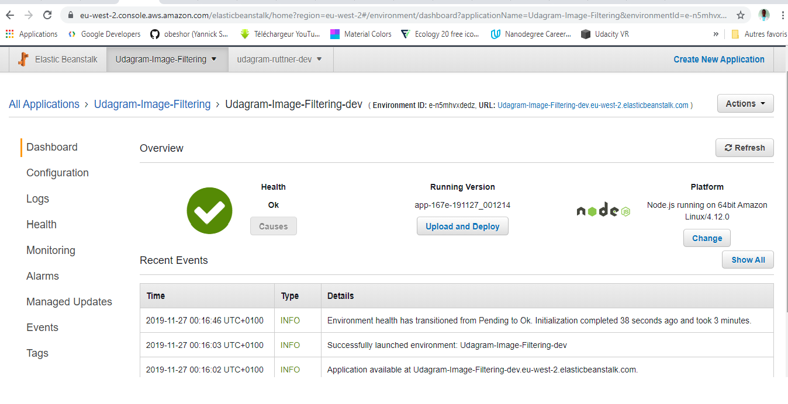

## Udagram-Image-Filtering
Udagram is a simple cloud application developed alongside the Udacity Cloud Engineering Nanodegree. It allows users to register and log into a web client, post photos to the feed, and process photos using an image filtering microservice
### AWS EB Endpoint
 * [Udagram-Image-Filtering-dev.eu-west-2.elasticbeanstalk.com](http://udagram-image-filtering-dev.eu-west-2.elasticbeanstalk.com/)
* [Test image](http://udagram-image-filtering-dev.eu-west-2.elasticbeanstalk.com/filteredimage?image_url=https://timedotcom.files.wordpress.com/2019/03/kitten-report.jpg)

### Screenshots

